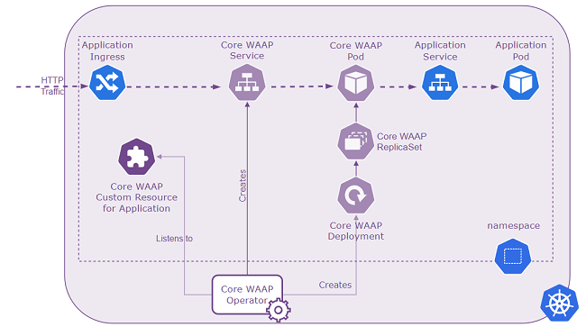

<!--
SPDX-FileCopyrightText: 2025 United Security Providers AG, Switzerland

SPDX-License-Identifier: GPL-3.0-only
-->

&#127919; In this step you will:

* Learn Kubernetes basics (Ingress / Service / Pod)
* Verify the USP Core WAAP operator is installed and ready

### Learn Kubernetes basics (Ingress / Service / Pod)

Have a look at the Kubernetes Ingress / Service / Pod architecture:


> &#128270; For this demo setup we are using a simple port-forward instead of an ingress resource.

### Verify the USP Core WAAP operator is installed and ready

You will now verify the **USP Core WAAP operator** is installed. The setup used will be slightly different in terms of traffic as it will be handled by USP Core WAAP which (acting as a reverse-proxy / WAF) will query the backend application itself:



To make use of USP Core WAAP the operator has to be installed and running. Installing kubernetes operators is out of scope for this lecture and therefore already prepared for you.

To check if the operator is running use the following command:

```shell
kubectl get pods \
  -n usp-core-waap-operator
```{{exec}}

<details>
<summary>example command output</summary>

```shell
NAME                                 READY   STATUS    RESTARTS        AGE
core-waap-operator-744f7c8b8-7kfbs   1/1     Running   1 (2m21s ago)   2m34s
```

</details>
<br />

The operator listens to resources of kind `CoreWaapService`. As soon as such a **CustomResource** is configured, the operator creates the further required resources to run an USP Core WAAP instance.

To check if a USP Core WAAP resource exists execute:

```shell
kubectl get corewaapservices --all-namespaces
```{{exec}}

There are none yet (`No resources found`) and also there are no core-waap PODs yet (they all get the label 'app.kubernetes.io/name=usp-core-waap'):

```shell
kubectl get pods \
  -l app.kubernetes.io/name=usp-core-waap \
  --all-namespaces
```{{exec}}

Now you can go ahead and change this in the next step as the USP Core WAAP Operator is ready you can configure a `CoreWaapService` now!
